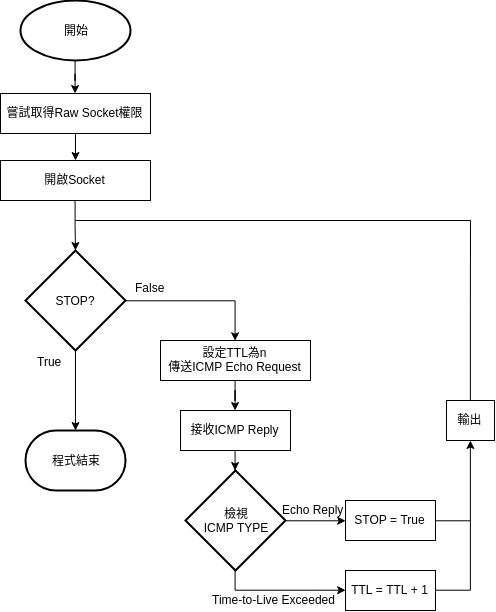
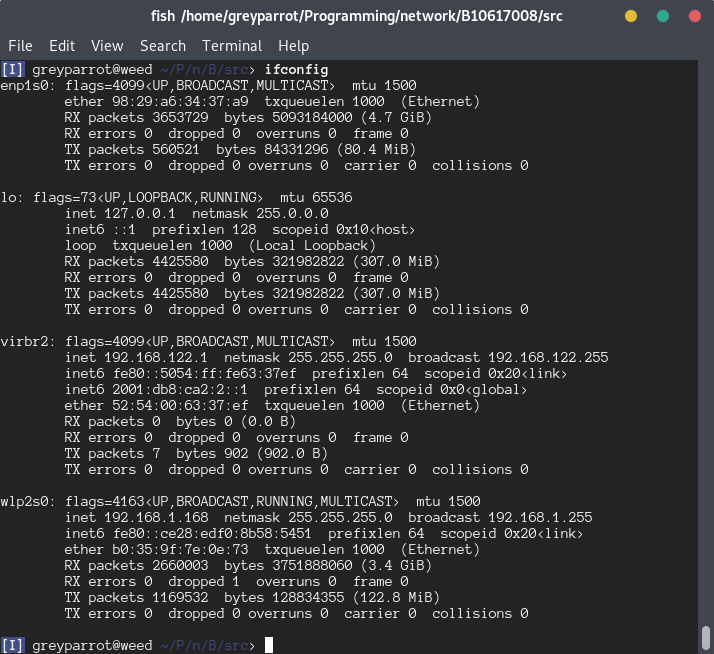

# traceroute

課堂上的作業:p

## FlowChart



## Required library

libcap-dev: This library is used to access capability during runtime.

### ubuntu/debian

```shell
$ sudo apt-get install libcap-dev
```

### Build & Run

   ```shell
   $ make
   $ ./traceroute 8.8.8.8 enp1s0
   $ ./traceroute 8.8.8.8 wlp2s0
   ```

### Run

This program require two arguments

```shell
$ ./traceroute.out <destination ip> <interface>
```

- destination ip : The destination IPv4 address, doesn't support DomainName and IPv6
- interface : The netwrok interface name.



